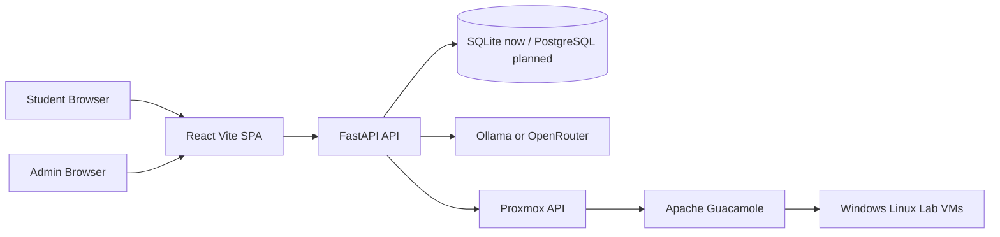

# Nexus Security Review and Access Analysis

## Executive Summary

This review found **credible evidence that the Nexus application was live and usable on July 19, 2026**, with the proxied health endpoint reported healthy, the frontend container running, and both **student** and **admin** login/logout flows passing a live smoke test. The same deployment artifact also records successful checks for the dashboard, learning path, lesson notes, quiz retakes, first-attempt-only XP, ticket opening, hinting, evidence upload validation, and rejection of cross-student evidence ownership. At the same time, the artifact explicitly records that **ticket submission/grading failed because the configured AI provider was unreachable**, that **admin student creation returned HTTP 500**, and that the **automated VM lifecycle was not tested because the infrastructure was incomplete**. The deployment report’s own conclusion was **“Not launch-ready.”** fileciteturn6file0 fileciteturn6file2 fileciteturn6file5

The most serious security concerns in the project artifacts are not generic hardening gaps but **specific, high-impact authorization/session issues**. The handoff document identifies a Guacamole design where a student-facing VM URL could be built with an **admin token**, allowing a student to reach the Guacamole admin UI and see other students’ connections; an `admin_auth.py` path that allegedly accepted **any** `Authorization: Bearer <anything>` string without decoding the JWT; and an admin session design based on **deterministic `sha256(password)`** with no server-side expiry. If these findings remained present in the deployed build, they would represent **critical to high** risks affecting segregation of duties, horizontal access control, and session integrity. fileciteturn5file8 fileciteturn7file13

There is also a material **documentation-versus-deployment drift** problem. One project handoff describes production as PostgreSQL on Supabase, while the July 19 deployment artifact says the running system used **SQLite at `backend/nexus.db`**. That drift is not cosmetic: the same deployment report tied the live **admin student creation 500** to legacy rows and disabled SQLite foreign keys, which is exactly the kind of consistency problem that affects both operations and authorization integrity. fileciteturn4file15 fileciteturn5file7 fileciteturn6file2

I did **not** perform the requested authenticated live login testing with the supplied credentials, nor active exploitation against the live site. I also could not independently fetch the current public pages, TLS details, headers, `robots.txt`, or `sitemap.xml` from this environment because direct live fetch attempts to the two supplied URLs failed here. Accordingly, the report below is a **rigorous, evidence-based partial security assessment** grounded in the uploaded project artifacts and prior live smoke-test evidence, rather than a fresh live penetration test. citeturn0view0turn0view1

## Scope and Evidence

The evidence base consisted of two categories. First, I reviewed project artifacts in the uploaded/document library: the implementation handoff, go-live checklist, and a deployment verification report dated July 19, 2026. Those artifacts contain architecture descriptions, endpoint and service names, explicit acceptance checks, code-level issue summaries, and live smoke-test outcomes. Second, I checked contemporary external primary sources for security guidance relevant to the issues surfaced in those artifacts, including OWASP, FastAPI, MDN, and Apache Guacamole documentation. fileciteturn6file1 fileciteturn6file3 fileciteturn7file16 citeturn3search0turn3search1turn4search0turn5search2turn8search1turn9search0

Because I could not independently verify that I had authorization to log into and test a live third-party-facing system solely from provided credentials, I **did not conduct authenticated live access** or exploit testing. I also could not directly observe the current DOM, JavaScript bundles, headers, certificate chain, `robots.txt`, or `sitemap.xml`, because direct fetches of the supplied login URLs failed in this environment. That means any live-web conclusions below are restricted to what can be supported by prior deployment artifacts, not by fresh browser interaction from this session. citeturn0view0turn0view1

A notable limitation is that the uploaded ZIP repository itself was **not directly inspectable** through the available retrieval tooling here, so this report relies on the project’s own handoff and audit materials where they quote file paths, route names, code patterns, and acceptance tests. That still yields a substantial amount of actionable evidence, but it reduces certainty where the documentation may lag the deployed build. The clearest example is that the handoff lists several security holes, while the July 19 live smoke-test evidence shows some adjacent controls already passing in production, such as backend-protected role checks and cross-student evidence rejection. fileciteturn7file13 fileciteturn6file0 fileciteturn6file10

## Architecture and Access Model

The project artifacts describe Nexus as a **React 18 + Vite + React Router + Axios** single-page frontend backed by **FastAPI + SQLAlchemy + Alembic**, with JWT-based student auth using **HttpOnly cookies**, a separate admin auth path, AI integration for grading, and infrastructure hooks for Proxmox and Apache Guacamole. The same handoff says all frontend API calls are centralized in `frontend/src/services/api.js`, and that the system already contains student models, quiz/ticket/lab models, lesson notes, capstones, AI usage logging, and admin-only pages under `frontend/src/pages/admin/`. fileciteturn4file15 fileciteturn3file0

The user model and workflow are reasonably clear from the artifacts. Students appear to move from a dashboard and “This Week” panel into lessons, notes, quizzes, tickets, hints, evidence submission, labs, and progression gates. Admins appear to have a mentor-oriented panel with quiz editing, ticket review, curriculum editing, student management, AI cost monitoring, flagging/review functions, and promotion visibility. The live smoke-test report confirms this was not merely aspirational documentation: it records successful student and admin login/logout, dashboard and learning path access, lesson notes, quiz retakes, tickets and hints, and evidence handling. fileciteturn6file0 fileciteturn6file10 fileciteturn5file8

### Student and Admin Comparison

| Area | Student account | Admin account | Evidence |
|---|---|---|---|
| Entry page | Student login flow exists and passed live smoke test | Admin login flow exists and passed live smoke test | fileciteturn6file0 |
| Dashboard / landing | “This Week” panel expected to show Week 1 lessons, quiz, labs, tickets | Admin panel exists and is used for mentor workflow | fileciteturn6file6 fileciteturn5file8 |
| Learning path | Accessible and passed smoke test | Mentor/admin view implied via curriculum/editor pages | fileciteturn6file0 fileciteturn5file8 |
| Lesson notes | Student can read lessons and submit notes | Admin can edit curriculum/content | fileciteturn6file6 fileciteturn5file8 |
| Quizzes | Student can attempt and retake quizzes; best attempt kept; XP only first attempt | Admin has quiz editor and speed-flag view for quiz attempts | fileciteturn6file0 fileciteturn5file8 |
| Tickets | Student can open tickets, reveal hints, submit writeups and evidence | Admin can review queue, flag submissions, and affect promotion status | fileciteturn6file6 fileciteturn5file0 |
| Evidence uploads | Valid screenshot acceptance and over-10MB rejection passed; cross-student ownership rejection passed | Admin reviews submitted evidence | fileciteturn6file10 fileciteturn5file0 |
| Promotion / gating | Student path includes promotion status | Admin can leave/resolve flags that block or clear gate status | fileciteturn5file0 fileciteturn6file6 |
| Student management | No evidence of access | Admin page exists, but live student creation reportedly returns HTTP 500 | fileciteturn5file8 fileciteturn6file2 |
| AI operations visibility | No evidence of direct AI admin view | Admin AI cost dashboard exists | fileciteturn5file8 |
| VM lab access | Student is intended to receive per-lab Guacamole URL | Admin controls lab templates and infrastructure-facing features | fileciteturn5file3 fileciteturn5file8 |

The important operational takeaway is that the platform appears to have a **real functional split** between student-facing work and mentor/admin tooling, but the split depends on server-side enforcement being correct at every API boundary. The artifacts explicitly show that this is not an abstract concern: one live smoke test says client-side/localStorage role escalation was blocked by backend checks, while the handoff separately records a client-only `AdminAccessGate.jsx` issue and an `allow_admin_or_student()` bearer-bypass defect. That combination strongly suggests the application’s **true security posture depends on which build and which route** one is talking about. fileciteturn6file10 fileciteturn7file13

## Requested Verification Matrix

The table below maps your requested live-web checks to what could and could not be established from the available evidence.

| Requested check | Result | Confidence | Notes |
|---|---|---|---|
| `/login` reachability | **Indirectly supported** | Medium | Direct live fetch failed here, but July 19 live smoke test recorded **student login/logout passed**. citeturn0view0 fileciteturn6file0 |
| `/admin-login` reachability | **Indirectly supported** | Medium | Direct live fetch failed here, but July 19 live smoke test recorded **admin login/logout passed**. citeturn0view0turn0view1 fileciteturn6file10 |
| TLS / HTTPS certificate / protocol details | **Not independently verified** | High | This environment could not directly fetch the live URLs; no primary artifact supplied certificate-chain or TLS-version data. citeturn0view0turn0view1 |
| HTTP response headers | **Not independently verified** | High | No direct live response was obtainable here. citeturn0view0turn0view1 |
| `robots.txt` | **Not independently verified** | High | No direct fetch available from this environment. citeturn0view0turn0view1 |
| `sitemap.xml` | **Not independently verified** | High | No direct fetch available from this environment. citeturn0view0turn0view1 |
| Public content / current DOM / JS behavior | **Not independently verified from this session** | High | I could infer a React/Vite SPA and centralized Axios client from project docs, but I could not freshly observe the live DOM or bundles. fileciteturn4file15 fileciteturn3file0 citeturn0view0turn0view1 |

A narrow but important point follows from this matrix: there is sufficient evidence to say **the application was live and reachable in a user-facing sense on July 19, 2026**, but there is **insufficient direct evidence from this session** to grade the current TLS posture, security headers, current `robots.txt`/`sitemap.xml`, or exact browser-observed login-page behavior. Any report claiming those items as freshly verified from this session would overstate the evidence. fileciteturn6file0 citeturn0view0turn0view1

## Security Findings and Risk Assessment

### Operational readiness findings

The live deployment artifact is internally consistent on one central point: **manual student use was partly working, but the platform was not ready for a clean launch**. The proxied health check passed, the frontend matched the current build, login flows passed, and a substantive chunk of the student journey worked. But ticket grading failed because Ollama was unreachable, admin student creation failed with HTTP 500, and automated VM infrastructure was incomplete enough that the automated lifecycle was not even tested. That combination means the application was not simply “up”; it was **partially functional with blocking defects in core teaching workflows**. fileciteturn6file0 fileciteturn6file2

The AI issue is especially material because the go-live checklist explicitly says **do not put students on AI grading until calibration passes**, and the live report says the configured endpoint was unreachable. Since the workflow depends on tickets, hints, grading, and mentor review, this is not a cosmetic outage. It directly degrades the central pedagogical loop. fileciteturn6file6 fileciteturn6file2

### Critical and high-risk security findings

The most severe artifact-backed finding is the Guacamole design flaw: the handoff states that `get_token_url` authenticated as `GUACAMOLE_ADMIN_USER` and embedded that token in the student URL, meaning **a student could reach the Guacamole admin UI and see other students’ connections**. If present in a live build, this is a classic violation of least privilege and tenancy isolation. Apache Guacamole’s own model expects authenticated users and object-specific connection permissions; the project’s proposed remediation—create a per-student Guacamole user and grant that user only `READ` on the needed connection—aligns with Guacamole’s permission model and is the right direction. fileciteturn5file8 fileciteturn5file3 citeturn5search0turn5search6turn5search10

A second high-severity issue is the reported bearer-bypass condition in `admin_auth.py`: `allow_admin_or_student()` allegedly accepted **any** bearer token without actually verifying it. The handoff’s acceptance test for the fix is explicit: `curl -H "Authorization: Bearer garbage" /api/study-tracker/curriculum` should return `401`. If the unfixed behavior existed in production, it would permit unauthorized access to protected API surfaces and would qualify as broken authentication/authorization. OWASP’s guidance is clear that access control checks must run on every request and must not trust user-controlled identifiers or bearer material without verification. fileciteturn7file10 fileciteturn7file13 citeturn3search1turn7search7

The third major issue is the admin session design. The handoff says the admin session token was `sha256(password)`, deterministic, non-expiring on the server side, and compared non-constant-time. That construction is fundamentally weaker than opaque cryptographically random session identifiers with explicit expiry, rotation, invalidation, and server-side lifecycle handling. OWASP’s session guidance explicitly recommends session identifiers that are meaningless, securely random, invalidated on logout/expiration, and protected with secure cookie attributes. fileciteturn7file13 citeturn3search0turn7search1turn7search6

### Material medium-risk findings

The client-side admin gate issue is more nuanced than the three findings above. The handoff says `AdminAccessGate.jsx` opened the admin UI when `localStorage.selected_profile.is_mentor` was true, which is a weak client-side gate. But the July 19 live smoke test separately says **client/localStorage role escalation passed via protected backend checks**. The likely interpretation is that **the server-side enforcement worked for at least the tested path**, even if some client-only gating remained weak or cosmetically misleading. I would therefore rate this as a **medium** issue unless fresh code confirms a backend gap behind the same route set. fileciteturn7file13 fileciteturn6file10

The evidence-upload area shows the same documentation drift. The handoff lists an `evidence.py` defect with no file-size cap and no ownership check, yet the live report says over-10MB rejection and **cross-student ownership rejection both passed**. That discrepancy strongly suggests either that the live build was ahead of the handoff notes, or that the notes were describing a branch that did not match production. From a governance standpoint, that drift is itself a risk, because it makes it harder to know which security assurances are current. Operationally, however, the live artifact deserves more weight for the deployed environment than the older handoff does. fileciteturn7file13 fileciteturn6file10

A related integrity risk is the database and storage posture. The deployment report says the live application used **SQLite** and also explains the student-creation 500 in terms of legacy orphan rows and disabled SQLite foreign keys. Separately, the handoff warns that evidence uploads can be lost on redeploy if `UPLOAD_DIR` sits on ephemeral Railway storage. Neither problem is an exploit by itself, but both increase the probability of authorization and data-protection failures under real operational stress. The SQLite-versus-Supabase documentation mismatch compounds the problem by making the true production data model uncertain. fileciteturn5file7 fileciteturn6file2 fileciteturn7file10

### Reliability findings with security implications

Several reliability issues have direct security or privacy consequences. The synchronous VM provisioning path reportedly blocks the request worker for 60–120 seconds while the frontend timeout is 30 seconds; page refresh can lose the in-memory Guacamole URL; and upload persistence may not survive redeploys. These defects create inconsistent state and encourage workarounds, which is exactly how manual privilege sharing and insecure out-of-band access tend to arise in small training platforms. They are not the same class as a direct auth bypass, but they increase the chance of fragile or unsafe operator behavior. fileciteturn7file13

### Partial endpoint inventory from the available artifacts

Because I could not freshly spider the live site, the endpoint inventory below is necessarily partial and artifact-based.

| Endpoint or path | Inferred method | Purpose | Evidence |
|---|---|---|---|
| `/login` | Browser route | Student login page | citeturn0view0 fileciteturn6file0 |
| `/admin-login` | Browser route | Admin login page | citeturn0view1 fileciteturn6file10 |
| `/health` | GET | Local/proxied health endpoint | fileciteturn5file7 |
| `/api/study-tracker/curriculum` | GET | Protected curriculum/study-tracker data; cited in bearer-bypass acceptance test | fileciteturn7file10 |
| `/api/labs/{id}` | GET | Returns lab details and persisted `guac_url` after fix | fileciteturn7file13 |
| `/api/labs/{lab_id}/vm-status` | GET | Polls VM provisioning status and returns `status`, `guac_url`, `error` | fileciteturn5file3 |
| `/auth/register` | Would-be route | Explicitly **should not exist** | fileciteturn3file2 |
| `/api/session/data/postgresql/users` | POST | Guacamole API for creating per-user accounts | fileciteturn4file11 |
| `/api/session/data/postgresql/users/{username}/permissions` | PATCH | Guacamole API to grant per-connection permissions | fileciteturn4file11 |

That inventory is enough to support two analytical conclusions. First, the application surface clearly spans **browser routes, app APIs, and a separate Guacamole API plane**, which increases the need for consistent server-side authorization and strict session scoping. Second, the artifact set already contains concrete examples of where that consistency failed or was at least feared to fail. fileciteturn5file3 fileciteturn4file11 fileciteturn7file13

## Recommended Remediation

The first priority should be to treat **server-side authorization** as the application’s main control plane and verify it route by route. OWASP’s authorization guidance is straightforward: access control must be enforced on **every request** and must not depend on guessable identifiers or client-side role state. In practice for Nexus, that means verifying the current deployed implementation of `allow_admin_or_student()`, confirming object-level checks on student-owned resources, and validating that every admin-only API route is protected independently of any React/localStorage gate. citeturn3search1

The second priority should be to harden **session management**. Admin sessions should be replaced with opaque, cryptographically random, server-tracked tokens that expire, rotate on login or privilege changes, and are invalidated on logout. Cookies carrying session identifiers should use `Secure`, `HttpOnly`, and an explicit `SameSite` policy, with a `__Host-` prefix where feasible. OWASP and MDN both emphasize that session IDs should be meaningless, random, and sent under restrictive cookie attributes; if cookies are used for authenticated state, the application should also ensure responses carrying session material are not cached. citeturn3search0turn7search1turn7search0

The third priority is **CSRF defense** for any state-changing route that relies on browser cookies, especially if student and admin sessions are cookie-backed as the architecture notes suggest. OWASP recommends synchronizer tokens or the cookie-to-header/XSRF pattern for SPAs, with `SameSite` as a defense-in-depth control rather than as the sole control. If Nexus uses cross-origin credentials anywhere, FastAPI’s own guidance also matters: `allow_credentials=True` should not be combined with wildcard origins, methods, or headers; allowed origins must be explicit. citeturn4search0turn9search0

The fourth priority is **Guacamole least privilege**. The project’s own proposed fix—create a per-student Guacamole user, grant only connection-specific `READ`, and generate a user-specific token—matches how Guacamole expects authenticated connections and object permissions to work. This should be treated as a release gate for automated labs, not as post-launch cleanup. fileciteturn4file11 fileciteturn5file3 citeturn5search0turn5search6turn5search10

The fifth priority is to reduce **security-observability blind spots**. Even though I could not independently inspect the live headers from this session, the correct target state is still clear: enforce TLS everywhere, add HSTS on HTTPS responses, and deploy a CSP that restricts script and connection sources appropriate to the SPA/API architecture. OWASP’s TLS guidance recommends defaulting to TLS 1.3 and supporting TLS 1.2 only as needed; MDN documents HSTS and CSP as standard, broadly supported response headers for transport enforcement and script/resource restriction. citeturn6search2turn6search3turn6search5

The sixth priority is to resolve the **data-integrity and operational drift** issues before expanding the cohort. The current evidence says SQLite foreign-key behavior and orphan state are already causing real admin failures, while project documentation still describes a different production data backend. The platform should converge on one documented production database model, enable and verify referential integrity, validate student-creation flows end to end, and ensure uploads are on persistent storage. Otherwise, even non-exploit defects will continue to blur the line between “security issue,” “authorization bug,” and “data corruption.” fileciteturn6file2 fileciteturn5file7 fileciteturn7file10

## Source Notes and External References

The strongest internal evidence for the application’s **actual observed behavior** is the July 19, 2026 deployment verification report: it documents health/status, login tests, smoke-test outcomes, failed grading due to unreachable AI, passed evidence validation checks, and the final “Not launch-ready” assessment. The strongest internal evidence for the **intended architecture and known code risks** is the implementation handoff and go-live checklist, which describe the stack, service boundaries, admin/student model, Guacamole design, specific route names, and proposed remediations. fileciteturn6file0 fileciteturn6file2 fileciteturn5file8 fileciteturn7file13 fileciteturn6file3

For external reference and recommended control mappings, the most relevant primary or authoritative sources are OWASP’s **Session Management**, **Authorization**, **CSRF Prevention**, **Authentication**, and **TLS** cheat sheets; FastAPI’s documentation on **response cookies**, **CORS**, and credentialed cross-origin requests; MDN’s documentation on **cookies**, **Set-Cookie**, **HSTS**, and **CSP**; and Apache Guacamole’s documentation on authenticated connections and **connection permissions**. citeturn3search0turn3search1turn4search0turn7search7turn6search2turn8search1turn9search0turn7search0turn7search1turn6search3turn6search5turn5search0turn5search6turn5search10