# Nexus Academy Phase 1 visual correction — PR #64

This is the real React learner Today page running from an isolated worktree. **All screenshot values are synthetic API fixtures**, not production/student data. The app itself continues to read existing APIs; fixtures exist only under `frontend/tests/phase1/`.

The primary before images are the rejected PR #64 implementation at `536fb8c`, preserved before this correction. Before and after use the same synthetic fixture account, API responses, theme preference, and **1440×900 CSS-pixel viewport**. Full-page captures include content below that viewport. The older `before-light-1440.png` and `before-dark-1440.png` are retained separately as original-main evidence; they are not the correction baseline.

## Before / after at the same desktop viewport

| | Before | Phase 1 |
| --- | --- | --- |
| Light | 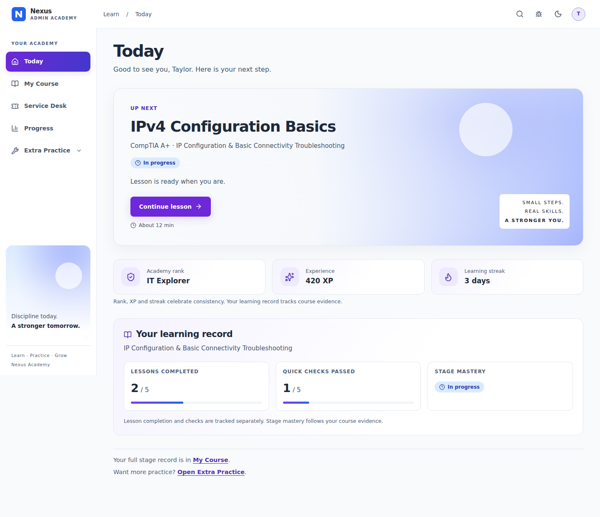 | 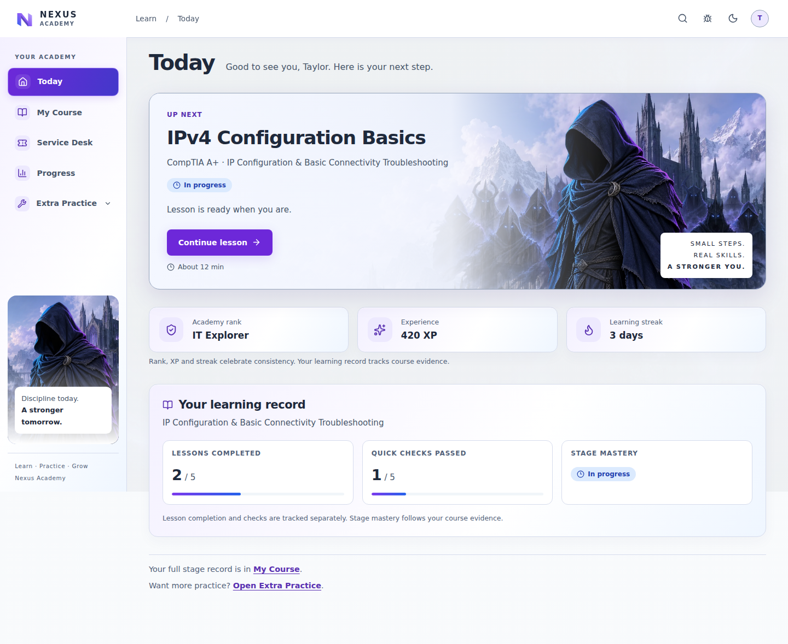 |
| Dark |  | 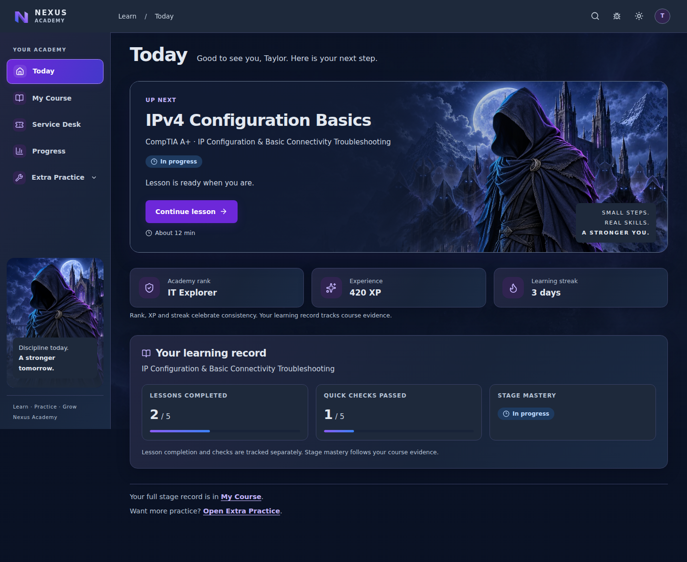 |

## Desktop and narrow comparisons

| Viewport | Light | Dark |
| --- | --- | --- |
| 1280×900 | 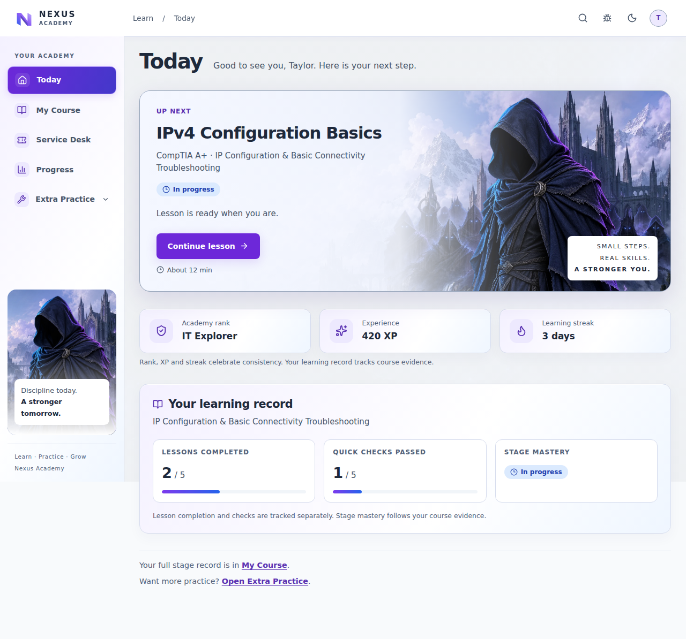 | 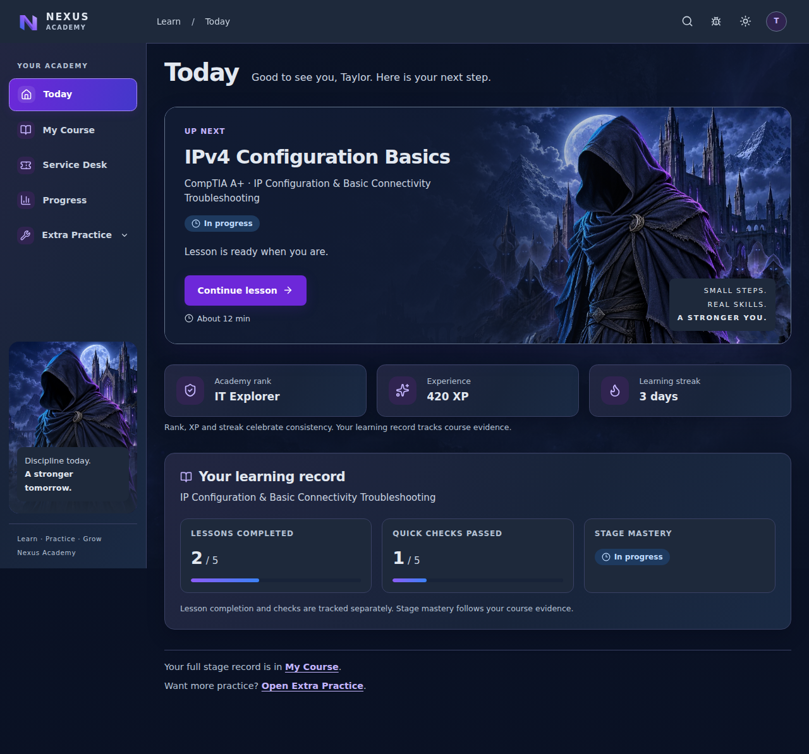 |
| 1024×900 | 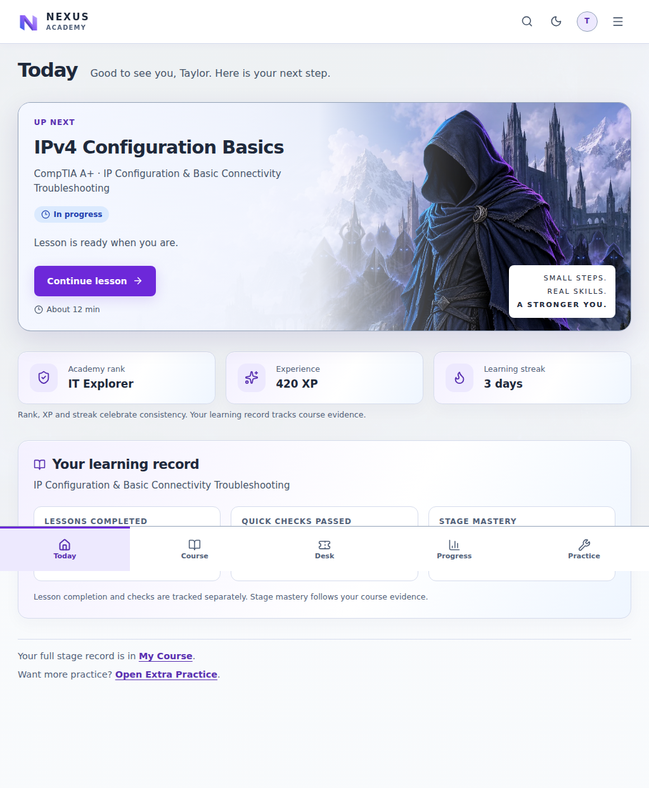 | 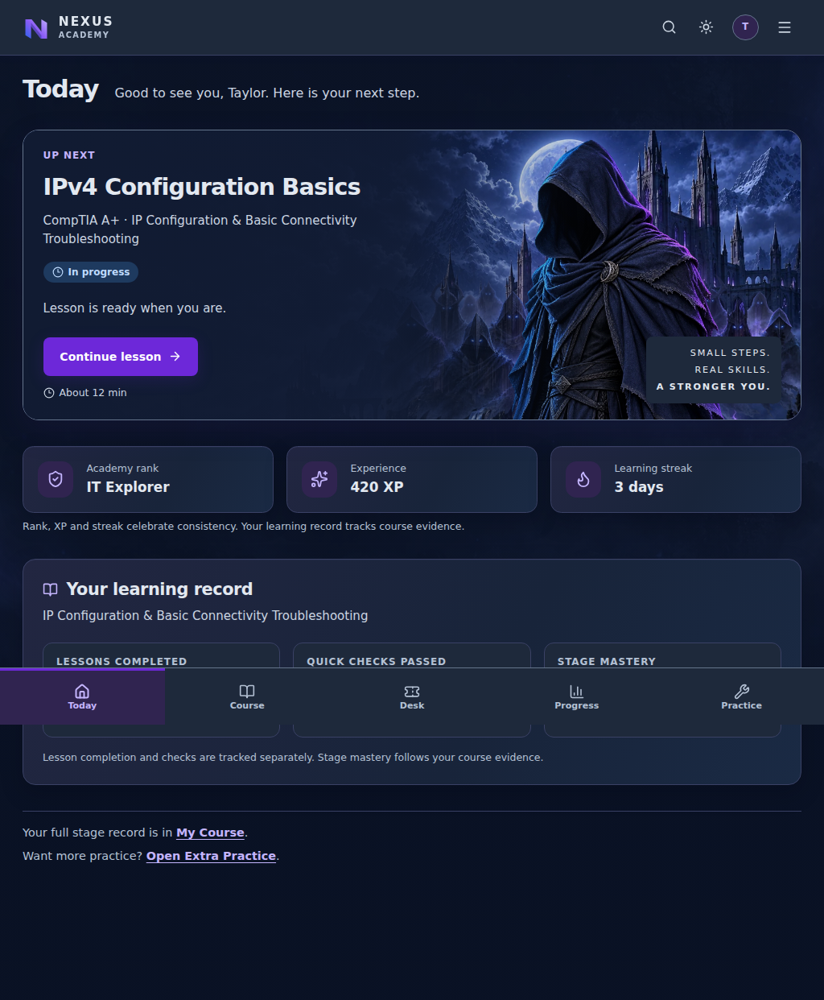 |
| 390×900 | 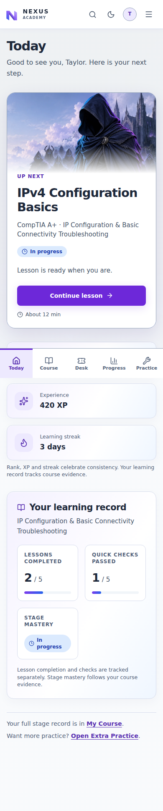 | 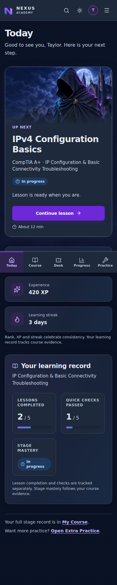 |

## Navigation states

| State | Light | Dark |
| --- | --- | --- |
| Extra Practice expanded |  | 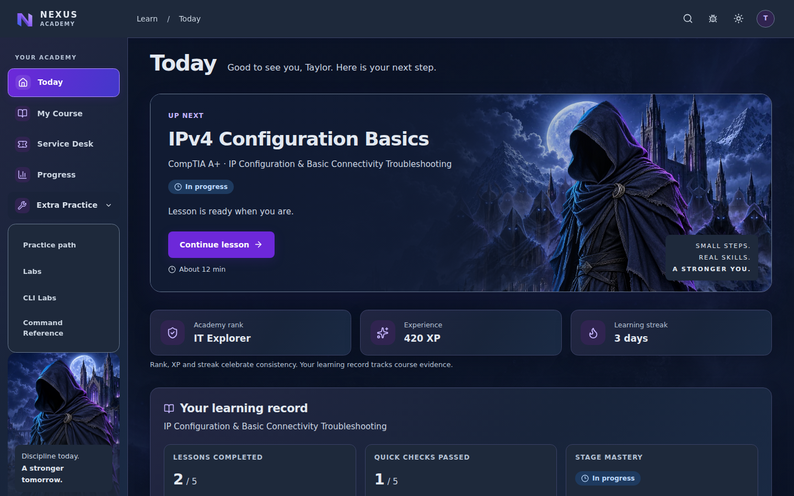 |
| Keyboard focus | 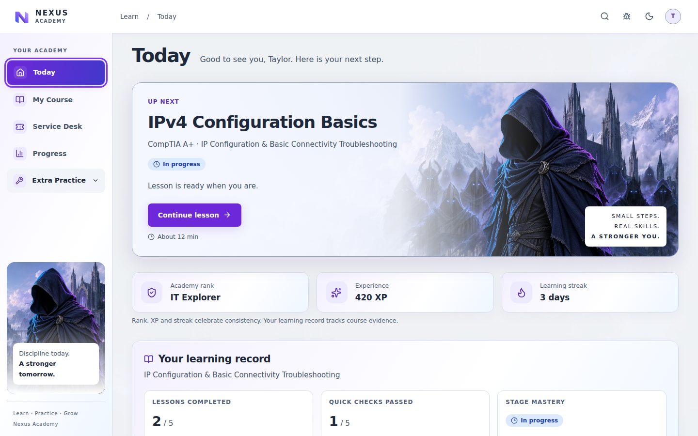 | 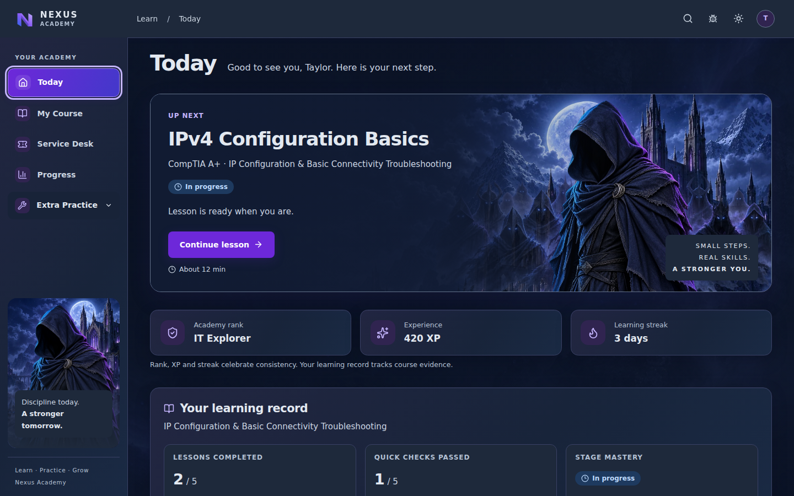 |
| Narrow menu | 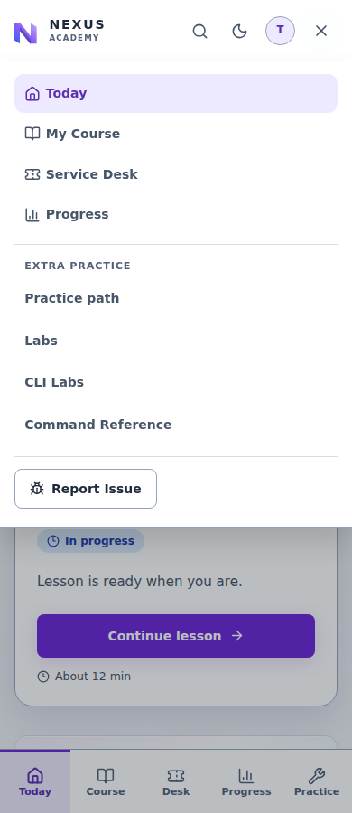 | 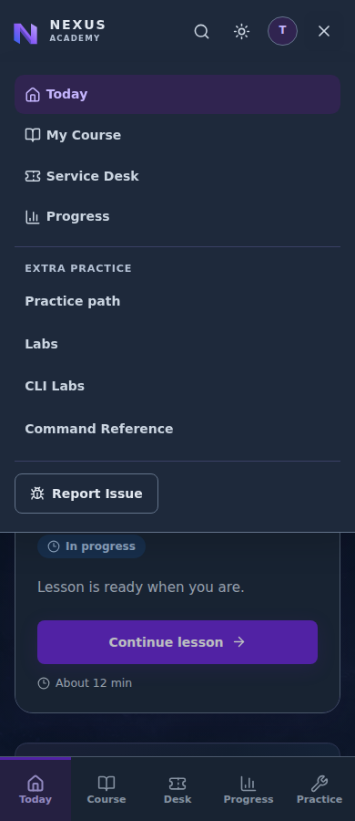 |

[Legacy cohort: three destinations](legacy-light-1440.png).

## Annotated differences from the references

1. **Navigation:** persistent vertical sidebar and blue/purple active treatment follow the boards. Destinations stay Today / My Course / Service Desk / Progress / Extra Practice for enrolled learners, and exactly Today / Service Desk / Progress for legacy learners. No fictional community, achievements, notification counter, profile, or settings routes were added.
2. **Hero:** one descriptive action still follows the API continuation route. The empty gradient scene is replaced by a layered castle/hood/army composition with blue/violet lighting and a strong reading scrim. Estimates appear only when supplied. Waiting, correction, completion, loading, retry, and empty states retain their meaning.
3. **Fantasy assets:** five original generated assets now replace the empty slots: day/night fortress, faceless hooded protagonist, glowing-eye shadow army, and ambient mist. An original SVG N mark and Nexus Academy branding replace the header’s reused favicon image and Admin Academy label. The right-side scene remains prominent behind the foreground figure; a strong left scrim protects the single action. The same scene appears subtly at the sidebar foot. See [every asset’s placement, generation recipes and hashes](../../design/phase1-artwork.md).
4. **Cards:** refined blue/violet borders, layered surfaces, icon wells and restrained shadows carry the fantasy mood through readable panels. Real rank, XP, and streak appear only if supplied, explicitly separated from lesson/check completion and server mastery. Unsupported task schedules, hours, achievement counts, and dates are omitted. An empty mentor panel is hidden; actual mentor follow-ups retain their own cards.
5. **Typography/controls:** system/local fonts; no external font source. Dark purple actions are darker than the proposed accent to keep white text legible. Decorative glows do not affect small text. Keyboard outlines remain explicit.
6. **Responsive scope:** compact desktop heading/spacing improves density; narrow heroes place artwork above a solid reading area. The existing bottom navigation and menu remain below desktop width; this is baseline overflow/reflow QA, not a broader mobile redesign. Fixed bottom bars in full-page screenshots show their viewport placement; scrolling still has bottom clearance.

## Remaining gaps against the approved target

The castle/hood/army direction is now visible in both themes. These generated assets and the new monogram are provisional and still need owner approval. System typography remains rather than a separately supplied brand font. Reference-only schedules, achievements and additional navigation are omitted because existing APIs do not support them. No lesson, quiz, ticket or Phase 2 redesign was started.

See [verification, exact changed files and reproduction](VERIFICATION.md). PR #64 remains draft and is not approved, merged or deployed.
