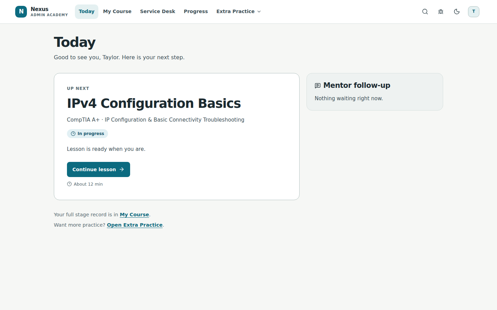
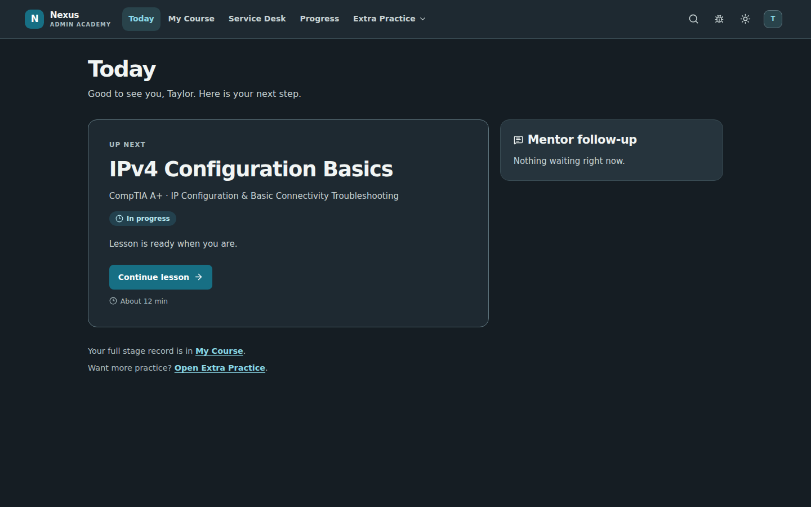

# Academy Phase 1 review gallery

This is the real React learner Today page running from an isolated worktree. **All screenshot values are synthetic API fixtures**, not production/student data. The app itself continues to read existing APIs; fixtures exist only under `frontend/tests/phase1/`.

The before images render unmodified verified `origin/main` (`663d623`) extracted to disposable space. Before and after use the same fixture account, API responses, theme preference, and **1440×900 CSS-pixel viewport**. Full-page captures include additional content below that viewport.

## Before / after at the same desktop viewport

| | Before | Phase 1 |
| --- | --- | --- |
| Light |  |  |
| Dark |  |  |

## Desktop and narrow comparisons

| Viewport | Light | Dark |
| --- | --- | --- |
| 1280×900 |  |  |
| 1024×900 |  |  |
| 390×900 |  |  |

## Navigation states

| State | Light | Dark |
| --- | --- | --- |
| Extra Practice expanded |  |  |
| Keyboard focus |  |  |
| Narrow menu |  |  |

[Legacy cohort: three destinations](legacy-light-1440.png).

## Annotated differences from the references

1. **Navigation:** persistent vertical sidebar and blue/purple active treatment follow the boards. Destinations stay Today / My Course / Service Desk / Progress / Extra Practice for enrolled learners, and exactly Today / Service Desk / Progress for legacy learners. No fictional community, achievements, notification counter, profile, or settings routes were added.
2. **Hero:** one descriptive action follows the API continuation route. The formerly duplicated-looking plain next-step card becomes the wide hero. Estimates appear only when supplied. Waiting, correction, completion, loading, retry, and empty states retain their meaning.
3. **Fantasy assets:** the panorama, faceless protagonist, shadows, and stylized original logo are **missing standalone cleared assets**. Their slots are deliberately empty. Gradients/orb establish composition and palette only; they are not a finished high-fidelity fantasy scene. See [asset provenance and specifications](../../design/phase1-artwork.md).
4. **Cards:** real rank, XP, and streak appear only if supplied, explicitly separated from lesson/check completion and server mastery. Unsupported task schedules, hours, achievement counts, and dates are omitted. An empty mentor panel is hidden; actual mentor follow-ups retain their own cards.
5. **Typography/controls:** system/local fonts; no external font source. Dark purple actions are darker than the proposed accent to keep white text legible. Decorative glows do not affect small text. Keyboard outlines remain explicit.
6. **Responsive scope:** the existing bottom navigation and menu remain below desktop width; this is baseline overflow/reflow QA, not a broader mobile redesign. Fixed bottom bars in full-page screenshots show their viewport placement; scrolling still has bottom clearance.

See [verification and reproduction](VERIFICATION.md) for exact test results and limitations. Phase 2 is not implemented; after owner approval it should address Learning Path and lesson UI only.
